<h1 align="center">基于Spring Boot 的校园服务平台系统【带论文】</h1>

- <b>完整代码获取地址：从戎源码网 ([https://armycodes.com/](https://armycodes.com/))</b>
- <b>技术探讨、资料分享，请加QQ群：692619798</b>
- <b>作者微信：19941326836  QQ：3645296857</b>
- <b>承接计算机毕业设计、Java毕业设计、Python毕业设计、深度学习、机器学习</b>
- <b>选题+开题报告+任务书+程序定制+安装调试+论文+答辩ppt 一条龙服务</b>
- <b>所有选题地址 ([https://github.com/Descartes007/allProject](https://github.com/Descartes007/allProject)) </b>

## 一、项目介绍

基于 Spring Boot 的校园服务平台（B/S 架构），系统面向三类主要角色：管理员、接单员、用户。项目已实现的功能模块及主要操作如下：
### 管理员（后台管理）
- 基本操作：登录、修改密码、获取/修改个人信息、登出
- 用户管理：查看/筛选用户、添加用户、修改用户、删除用户、
- 任务管理（跑腿任务）：分页列表、查看详情、新增/修改/删除任务、、审核/管理任务状态
- 接单员管理：查看/筛选接单员、查看详情、管理接单员信息
- 收货地址管理：查看/新增/修改/删除收货地址（与任务关联）
- 余额与账变：查看用户余额、余额变更记录
- 公告管理：公告（新闻）CRUD
- 投诉管理：用户投诉的查看/处理/删除
### 接单员
- 基本操作：登录、修改密码、获取/修改个人信息
- 任务查看与接单：查看待接/已接任务列表、查看任务详情、接单/处理任务、修改任务状态
- 查看与管理接单相关明细（接单详情模块）
- 查看用户投诉与公告
### 用户
- 账号操作：注册、登录、密码重置、获取 session 信息
- 发布跑腿任务：填写任务、选择收货地址、支付任务金额（系统检查余额并扣款）
- 任务查询：查看我的任务列表、详情、申请/撤销等
- 收货地址管理：新增/修改/删除地址
- 投诉与反馈：提交投诉、查看投诉处理状态

## 二、项目技术

- 编程语言：Java（后端）、JavaScript/Vue（前端）
- 项目架构：B/S（浏览器/服务器）
- 前端技术：Vue.js（单文件组件）,Vue Router（路由管理）,Axios（封装请求、请求/响应拦截）,Element UI（组件库）

## 三、运行环境

- JDK版本：1.8及以上都可以
- 操作系统：Windows7/10、MacOS
- 开发工具：IDEA、Ecplise、MyEclipse都可以

## 四、数据库配置文件

- npm版本：6.14.13及以上都可以
- Redis版本：3.2.100及以上都可以
- 文件名：application.yml
- 编码类型：utf8

## 论文截图

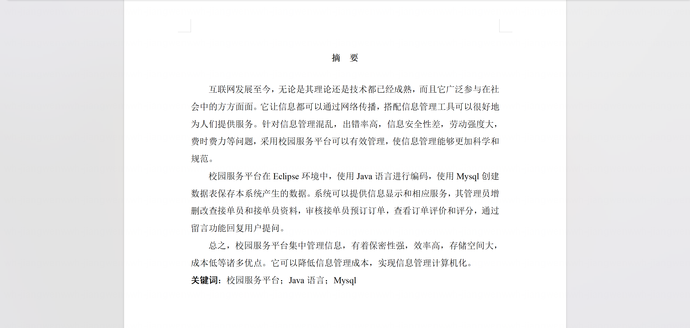

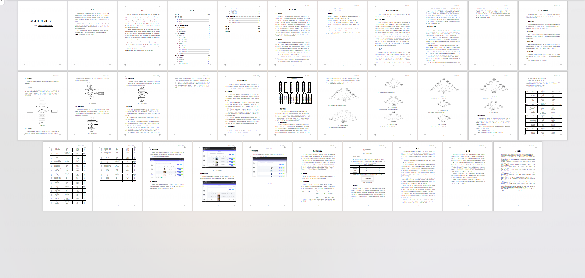

## 系统截图

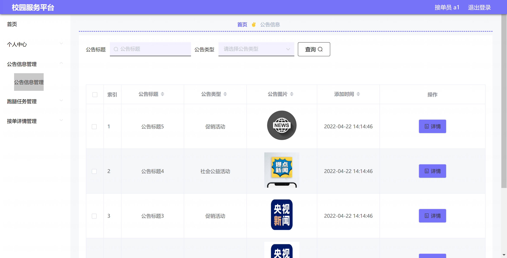

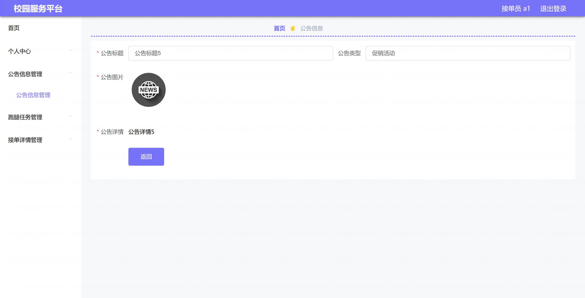

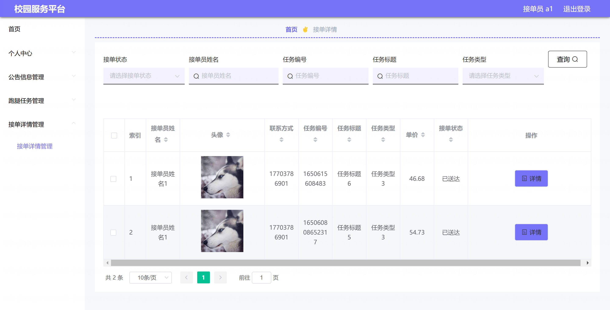

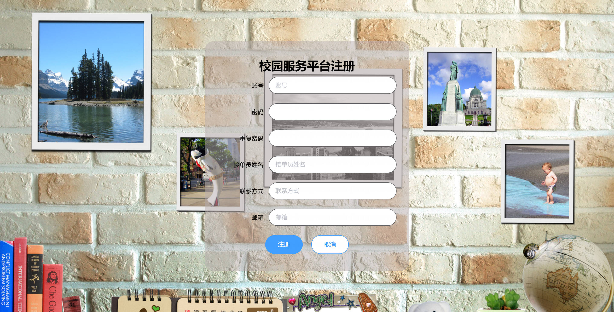

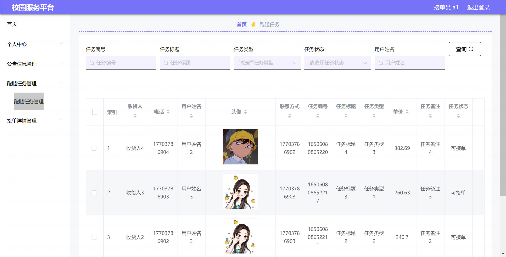

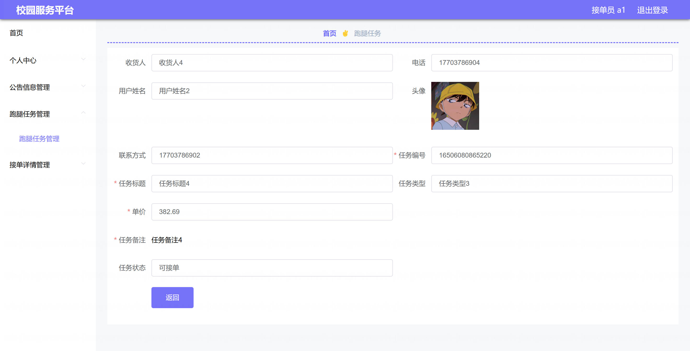

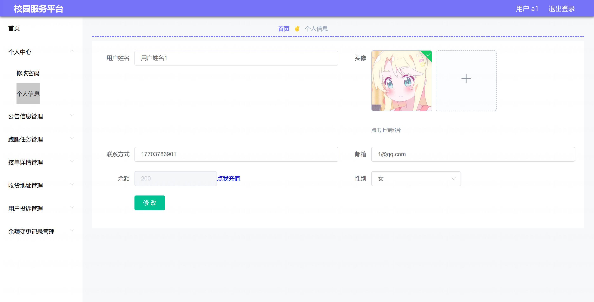

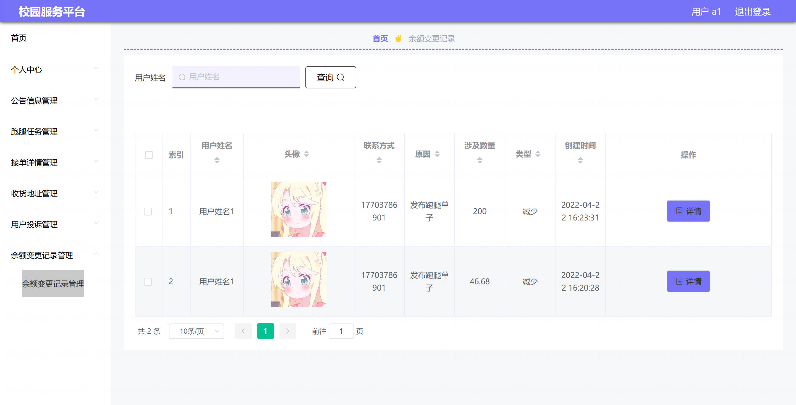

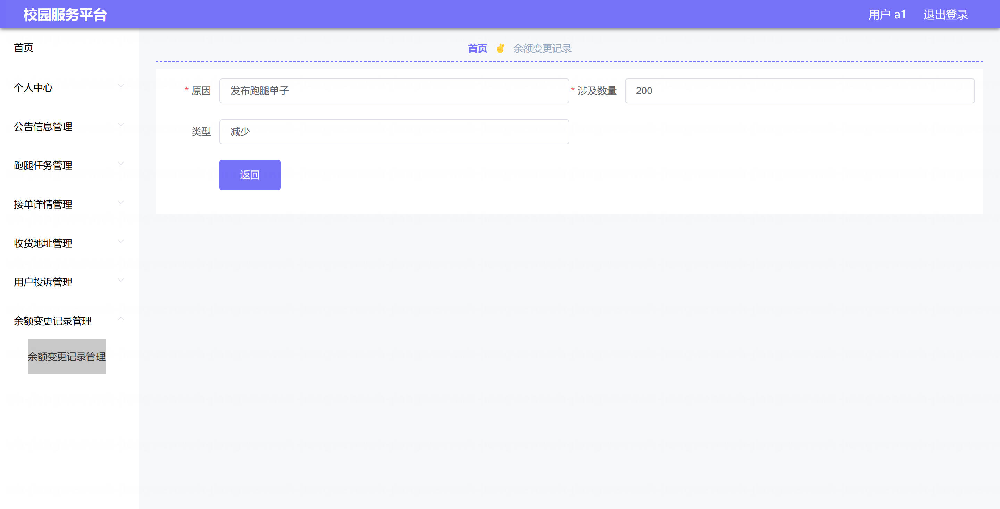

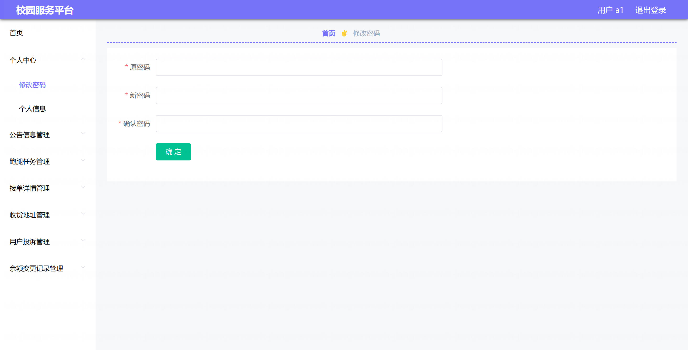
